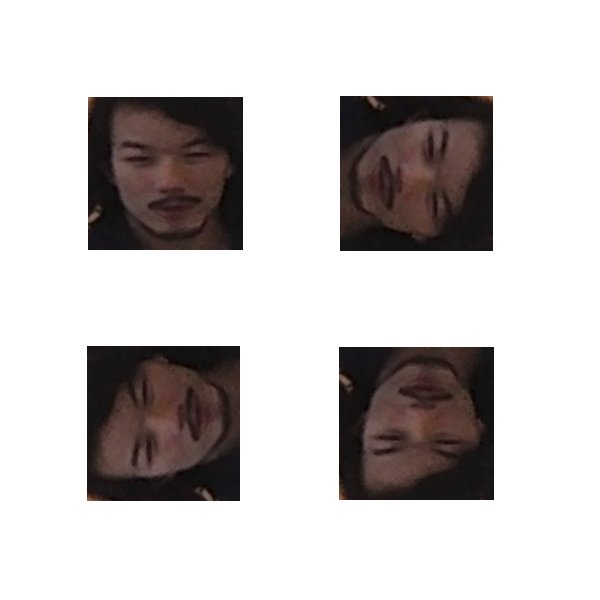

# FaceRot
Computer vision for automatic rotation of face pictures.

## The task
Imagine we have a model deployed on the cloud which performs face recognition on images sent to it.This model works great on well-oriented images, i.e. images which are the right way up. However, when badly-oriented images are sent, e.g. upside-down images, the model performs poorly. Since we have no  control over how the images are sent and have no guarantee that the images will come with orientation-metadata, we would like a pre-processing step which fixes the orientation of the images before being sent to the main model. The possible orientations are 0, 90, 180, 270 degrees with respect to the refence orientation (up-down).

From lef to right and from top to bottom: reference orientation (0°), +90°, +180°, +270°.

## Data
The dataset of faces (merge of many dataset freely available on the web, [link](http://www.face-rec.org/databases/)) is available on Kaggle [here](https://www.kaggle.com/gasgallo/faces-data-new). It's a collection of around 8k pictures of different individuals in different poses and different backgrounds.
Of course these pictures are more complicated (noise, background, scale, etc.) than the one provided as a test example, so if the model will perform good with them, it will for sure perform better with the example-like ones.

## Build a model
The model used in this case is a precompiled one that exploits HOG+SVM to detect a face into a given picture, for details look here ([dlib](http://dlib.net/python/index.html#dlib.get_frontal_face_detector)). It's robust and can detect faces in an accurate way. An important feature of this model is that it detects faces only if they're up-down (or almost up-down) oriented. So if the given picture is rotated (not up-down oriented) by an agle big enough (in our case, this condition is always satisfied), the model won't detect any face.
I've exploited this feature. I rotate the input picture by (0, 90, 180, 270) degrees until a face is detected by the model and I take a note about which rotation makes the model detect the face. Then I process the input image and rotate it by the opposite of the previously found angle.

The accuracy reached on the test set when a face is detected is over 97%. Take into consideratio that the dataset used for testing is way more noisy and various than the picture provided as a test example. Though, I assume that the accuracy on a dataset of pictures similar to the example one could reach values extremely close to 100%.

## Create an API
You can evaluate the model with `evaluate.py` script to correct the orientation of any image. You can run it as follows:

`python evaluate.py <path_to_input_image_or_directory>`

You can also specify the following command line arguments:
- `-o, --output` to specify the output image or directory (otherwise the input image gets overwritten).

## Test units
You can test the model with `test.py` script to evaluate the accuracy of the model over a given dataset. You can run it as follows:

`python test.py <path_to_input_image_or_directory>`

It returns a log of the process and the final values of:
- total accuracy on detected faces
- not detected faces
- corrupted files

## Deployment
To host the model and make available the API directly on the cloud, I've decided to use the free service provided by FloydHub ([link](https://www.floydhub.com/jobs)). Indeed, I've created and setup the service with the help of [flask](http://flask.pocoo.org/) and the backend framework of FloydHub that deployed my model into a Docker container.
The service is publicly available and can be tested by anyone without the need of having a Python machine. You can run the inference on the model as follows:

`curl -o <path_to_output_image> -F "file=@<path_to_input_image>" <url_to_hosting_server>`

The job isn't constanly running on the server due to a limited amount of free-to-charge runtime. To obtain a working URL to test the code, please contact me and I'll get back to you with a working URL.

## Considerations
Due to the fact that the task is pretty easy, even some simple computer vision is quite a good solution to solve this problem. For a more complicated approach (dealing with DCNNs), see my other repository [here](https://github.com/gasgallo/RotNet).
